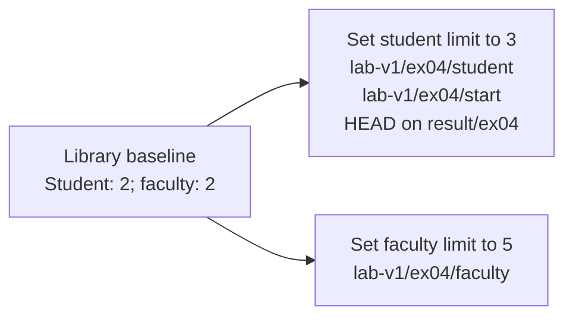
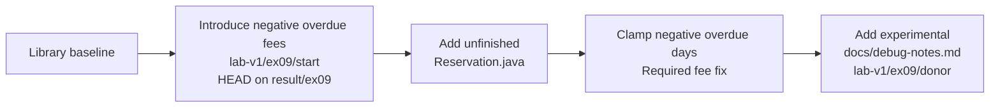
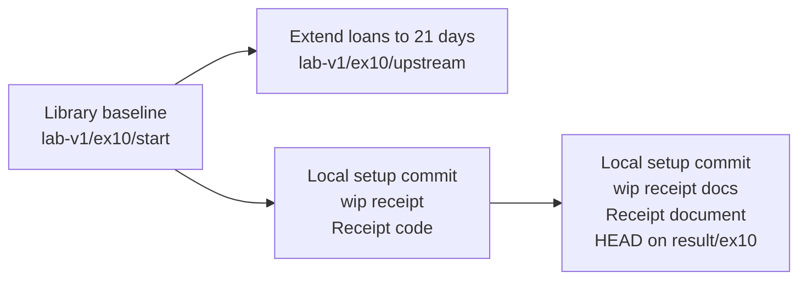
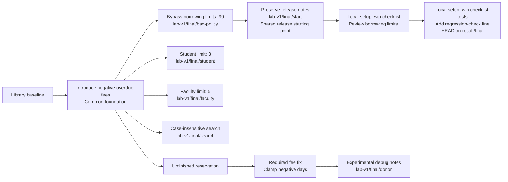

# Starting commit graphs

These graphs show the prepared histories **before you solve each task**. Labels describe changes instead of using machine-specific commit IDs. Solid arrows run from an older parent commit to its newer child; they do not show commands to execute. Branch names and tags identify the commits described in their boxes.

The graphs are schematic: spacing has no meaning, and a tag is a name for a commit, not another commit. Inspect the actual workspace with `git log --oneline --graph --decorate --all` and `git show` before acting.

## Exercise 04: two policy edits

Both commits change the same `maxBooks` method from the same baseline. The student side still has the baseline faculty limit; the faculty side still has the baseline student limit. Neither side already implements both requirements. No merge or `feature/ex04` branch exists at the initial state.

Variant B has the same shape, with tags under `lab-v1/ex04-b/`: student limit **4**, faculty limit **6**. The local starting branch remains `result/ex04`.

[Exercise 04 instructions](exercises/04.md)

## Exercise 09: one useful patch in a longer history

Your result branch initially stops at the fee bug. The donor tag identifies the last commit, after both the useful fix and unrelated changes. The reservation commit comes **before** the fee fix in that history, but the fee patch changes `LoanPolicy.java` and does not depend on the reservation class. Selecting a commit's patch does not require bringing in every earlier donor change.

Variant B uses `lab-v1/ex09-b/donor` and the same starting tag. Its middle fix clamps negative days and sets the positive rate to **200** instead of **100**. The ordering and excluded files are unchanged.

[Exercise 09 instructions](exercises/09.md)

## Exercise 10: private work and a newer base

The two WIP commits are created locally by `start`; they are not published answers. The loan-period helper and your receipt work share the starting commit but do not yet include one another. The exercise asks for a new base and a cleaner private commit sequence; this diagram does not show the completed history.

Variant B uses the start and upstream tags under `lab-v1/ex10-b/`. Its helper extends loans to **28 days**. The locally created receipt commits and result-branch name are otherwise the same.

[Exercise 10 instructions](exercises/10.md)

## Final: shared release history and private checklist work

Read the two different starting positions carefully:

- **Shared starting point:** `lab-v1/final/start` includes the fee bug, the bad borrowing policy, and useful release notes. It is the PR target's starting commit. "Shared" does not mean the application is already correct.
- **Current local HEAD:** `result/final` initially has two additional WIP commits for `docs/release-checklist.md`. These are private setup work, so they can be reorganized before publication. Do not publish that WIP tip as the PR's starting target.

The student, faculty, and search helpers branch from the common foundation **before** the 99-book mistake and release-notes commit. Each carries only its own proposed feature. The donor's fee fix is between unrelated changes and has no dependency on the reservation prototype. Existing release notes are on the shared release line, so replacing that line wholesale with a helper would lose required work.

Variant B shares `lab-v1/final/start` and `lab-v1/final/bad-policy`. Its feature and donor tags are under `lab-v1/final-b/`: student limit **4**, faculty limit **6**, and fee rate **200**. The graph structure and two private checklist commits are unchanged.

[Final instructions](exercises/final.md) · [Submission guide](SUBMISSION.md)
